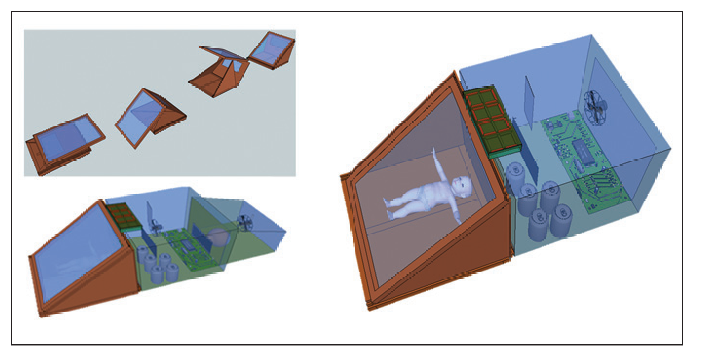
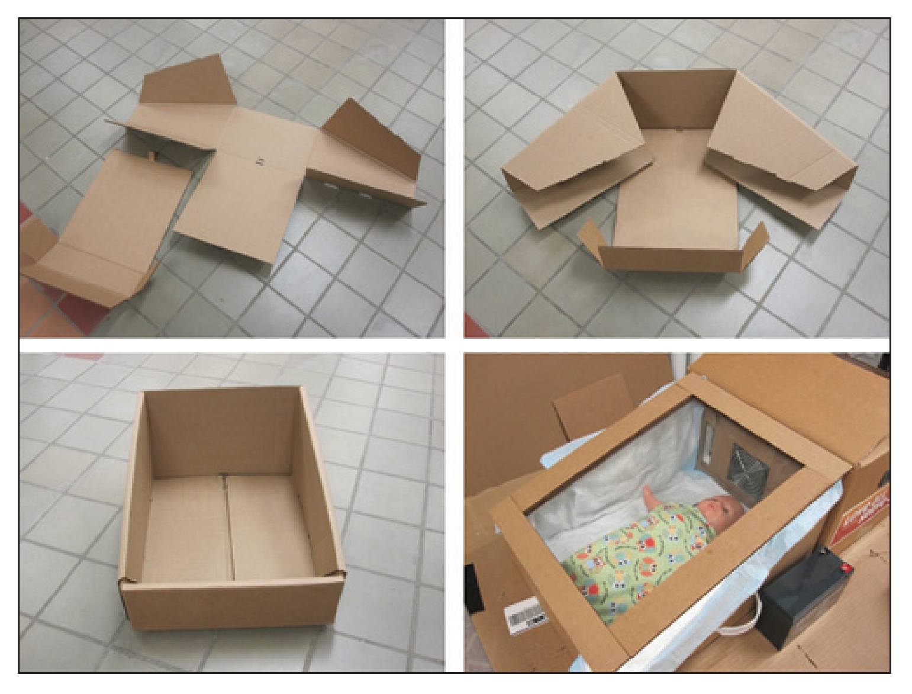

# Low Cost Disposable Baby Incubator With Health Monitoring and ECG Visualization Capabilities

## Contents

- [Overview](#overview)
- [Key Features](#key-features)
- [Mobile Interface](#mobile-interface)
- [Contributors](#contributors)

## Overview

This project integrates Arduino and Python to create a comprehensive health monitoring system that tracks multiple vital parameters—such as heart rate, SpO₂ levels, temperature, and humidity—alongside jaundice detection using an RGB color sensor. Additionally, the system serves as a **basic incubator controller** by monitoring and regulating temperature and humidity, which are essential for neonatal care. Data collected by Arduino from the sensors is transmitted to a computer, where a Python PyQt-based interface visualizes ECG signals in real-time.

Our incubator system draws inspiration from the paper "Designing a Low-Cost Multifunctional Infant Incubator" by Kevin Tran, Aaron Gibson, Don Wong, Dagmawi Tilahun, Nicholas Selock, Theresa Good, Geetha Ram, Leah Tolosa, Michael Tolosa, Yordan Kostov, and others. This study outlines innovative approaches to neonatal care, focusing on cost-effective, modular designs, and infection control measures. By integrating the scientifically proven methods described in the paper, we have ensured that our incubator aligns with evidence-based best practices, making it practical and impactful in addressing critical challenges in low-resource settings.

  

This figure demonstrates the modularity and cost-efficiency of the design. It illustrates how the disposable infant chamber is made from insulated cardboard and flat-packed for easy assembly. This chamber integrates seamlessly with a reusable control module that includes temperature regulation and power systems. Additionally, an optional cooling module, designed to accommodate diverse environmental needs, can be attached to enhance functionality.

 

  

The thermal analysis in this figure highlights the importance of precise heat insulation. A controlled environmental chamber replicates varying climates to test temperature stability. The incubator’s lid, made of triple-paned clear polyvinylchloride (PVC) film, offers superior insulation while maintaining visibility, reducing energy loss, and ensuring a stable internal environment for neonatal care.

 

  

This sequence showcases the step-by-step assembly of the flat-packable infant chamber. The lightweight and disposable design emphasizes portability and cost-effectiveness, catering to low-resource settings. The final prototype combines ease of use with innovative thermal management solutions, such as the optional cooling unit and a thermal bank, tailored for extended off-grid operation.

 

  
  

 

## Key Features

- **Heart Rate and SpO₂ Monitoring**: Utilizing the MAX30100 sensor for accurate BPM and blood oxygen levels.
- **Temperature and Humidity Tracking**: Employs the DHT11 sensor to gauge environmental conditions.
- **Jaundice Detection**: Measures RGB color values through an RGB sensor to aid in jaundice assessment.
- **Incubator Temperature Control**: Basic functionality to regulate temperature via relay and fan control, enabling essential thermal management.
- **ECG Visualization**: Displays animated ECG data, derived from BPM input, to provide a clear, live representation of cardiac activity.

## Mobile Interface

A mobile app interface was also developed for remote monitoring capabilities.  
[Mobile Application Demo Link to be Updated Soon](youtube.com)

---

This project offers a scalable approach to health monitoring, combining sensor-based data collection with an intuitive GUI for real-time ECG visualization and temperature control—ideal for applications in healthcare and neonatal care monitoring.

## Contributors

- **Ibrahim Fateen**  
  [LinkedIn](https://www.linkedin.com/in/ibrahim-fateen-a93b411ab/)

- **Youssef Abo-El-Ela**  
  [LinkedIn](https://www.linkedin.com/in/youssef-abo-el-ela-a4a12b235/)

- **Ali Younis**  
  [LinkedIn](https://www.linkedin.com/in/ali-younis-98b780277/)

- **Omar Khaled**  
  [LinkedIn](https://www.linkedin.com/in/omar-khaled-064b7930a/)

